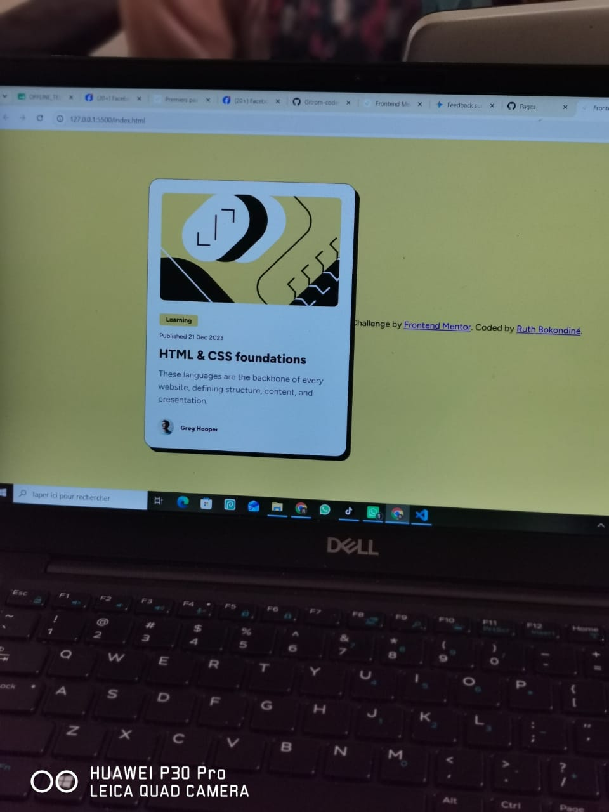

# Frontend Mentor - Blog preview card solution

This is a solution to the [Blog preview card challenge on Frontend Mentor](https://ruth-bokondine-dev.github.io/carte-de-pr-visualisation-de-blog/).

## Table of contents

- [Overview](#overview)
  - [The challenge](#the-challenge)
  - [Screenshot](#screenshot)
- [My process](#my-process)
  - [Built with](#built-with)
  - [What I learned](#what-i-learned)
- [Author](#author)

## Overview

### The challenge

Users should be able to:
- See hover and focus states for all interactive elements on the page

### Screenshot

## My process

### Built with

- Semantic HTML5 markup
- CSS custom properties & Flexbox
- Fluid typography using `clamp()`
- Mobile-first workflow

### What I learned

This project was a great opportunity to practice foundational HTML and CSS skills, specifically focusing on creating a modern card component with a rigid shadow look and handling fluid font sizes without media queries.

## Author

## Author
- Coded by Ruth Bokondiné
- Frontend Mentor - [@Ruth-Bokondine-dev](https://www.frontendmentor.io/profile/Ruth-Bokondine-dev)

